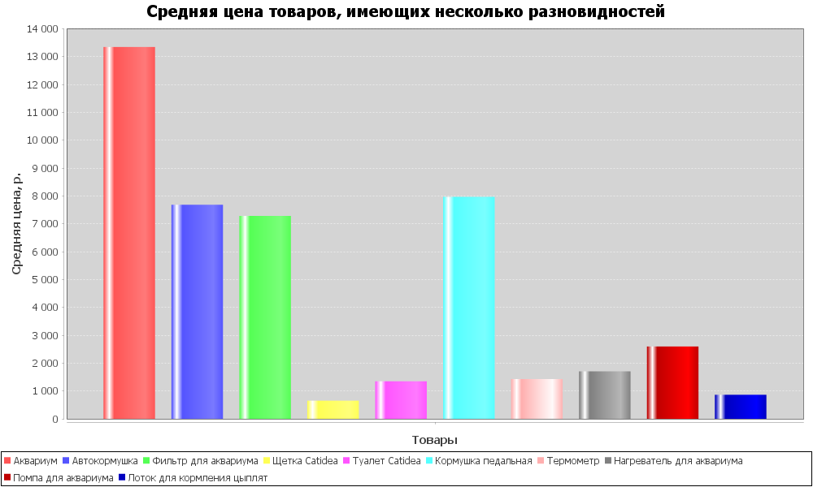
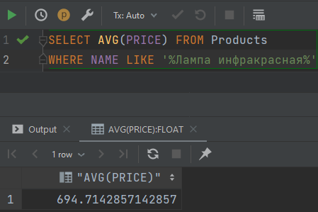
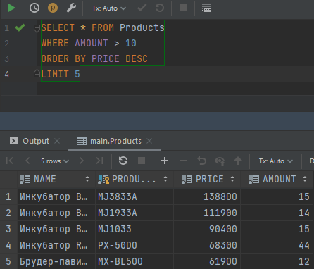

# Итоговый проект по курсу Java на платформе ulearn.

---

## Гистограмма средних цен товаров, имеющих несколько разновидностей

---

## Средняя стоимость инфракрасной лампы

---

## Выборка 5 самых дорогих товаров с остатком на складе больше 10

---

# Последовательность работы по проекту

1. Создание базы данных и класса DbConnection, который содержит функционал для подключения к БД (в моем случае - метод для создания подключения к бд).
2. Создание класса Product, описывающего сущность Продукт, представленного в catalog.csv.
3. Создание класса CsvTools, содержащего функционал для работы с .csv файлами (парсинг .csv -> List<Products>).
4. Создание класса DbTools, содержащего функционал для взаимодействия с БД (обновление БД данными, полученными из парсера).
5. Создание Main.java как входной точки программы.

