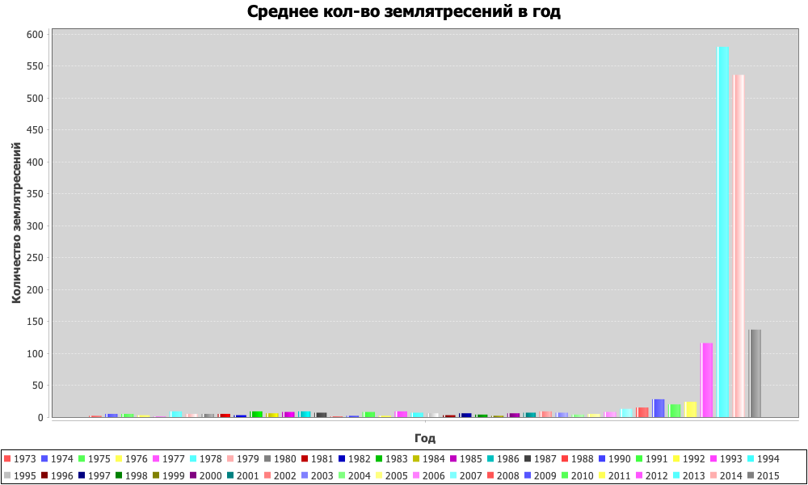
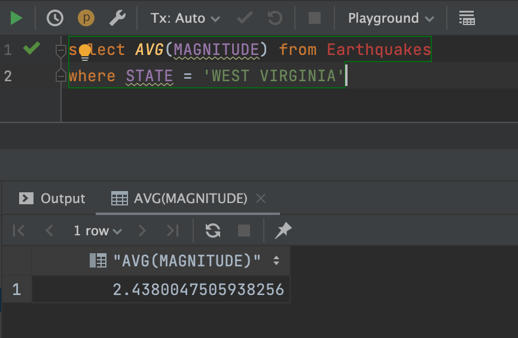
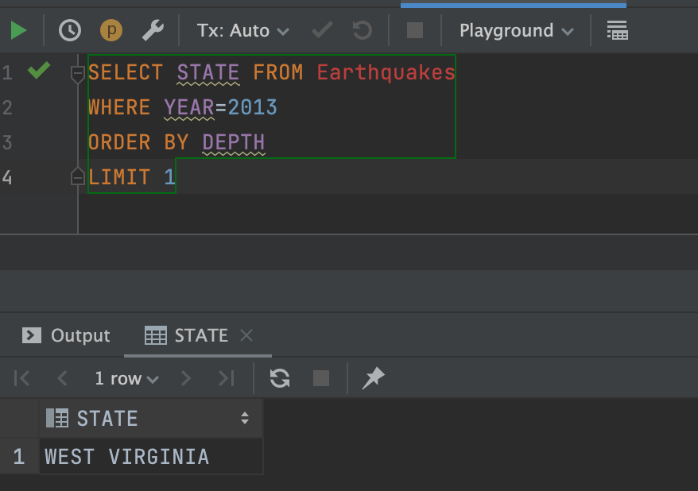

# Семестровый проект по Java на платформе Ulearn

---

## Среднее количество землятресений за каждый год

---

## Средняя магнитуда для штата West Virginia

---

## Название штата, в котором произошло самое глубокое землятресение в 2013 году

---

# Последовательность работы по проекту;
 
1) Создание dto Earthquake для экспорта сущностей из csv в БД
2) Подключение базы данных, создание класса Db с методами для работы с БД
3) Создание класса CsvTools для парсинга csv файла
4) Создание класса Histogram для создания графиков
5) Рефакторинг и мелкие багфиксы, написание ридми и загрузка проекта на гитхаб